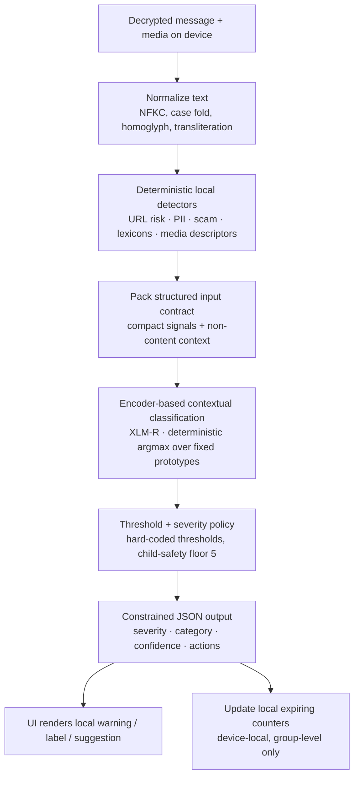
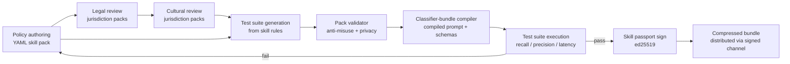

# KChat Guardrail Skills — Architecture

## System Overview

KChat is an end-to-end encrypted messaging app. Plaintext exists only on the
sender and recipient devices. We add a **local safety assistant** to each
device — the **XLM-R** encoder classifier driving a layered set of
skill packs — that classifies content already visible to the user and
produces local warnings, labels, and suggestions.

The encoder classifier is **not** a centralized moderator. It is a personal
safety co-pilot governed by transparent, signed, versioned skill packs. The
composition of those skill packs into a runtime bundle is the heart of this
architecture.

```
                     ┌──────────────────────────┐
                     │    GLOBAL BASELINE       │   always on
                     │   (taxonomy, severity,   │
                     │    privacy, schema)      │
                     └───────────┬──────────────┘
                                 │
              ┌──────────────────┴──────────────────┐
              ▼                                     ▼
   ┌────────────────────┐              ┌────────────────────────┐
   │ JURISDICTION       │  optional    │ COMMUNITY OVERLAY      │  optional
   │ OVERLAY            │              │ (school / family /     │
   │ (country / region) │              │  workplace / …)        │
   └─────────┬──────────┘              └────────────┬───────────┘
             └──────────────────┬───────────────────┘
                                ▼
                  ┌──────────────────────────┐
                  │   active_skill_bundle    │
                  │  + runtime context       │
                  └─────────────┬────────────┘
                                ▼
                  compiled classifier-bundle prompt
```

The **active skill bundle** at runtime is:

```
active_skill_bundle =
    global_baseline
  + jurisdiction overlays
  + community overlay
  + runtime context
```

Where `runtime context` is *non-content* metadata such as the group's
declared age mode, the recipient's relationship to the sender (already known
on-device), and timestamps. It is never derived from inferred attributes
(e.g. ethnicity, religion, GPS).

## Skill Layering Model

### 1. Global Baseline Skill — `kchat.global.guardrail.baseline`

The global baseline is **always active**. It defines:

- The 16-category global risk taxonomy (see [Global Risk Taxonomy](#global-risk-taxonomy)).
- The 0–5 severity rubric (see [Severity Rubric](#severity-rubric)).
- The non-negotiable privacy rules (see [Privacy Architecture](#privacy-architecture)).
- The structured input contract and the constrained JSON output schema.
- Decision policy thresholds and uncertainty handling.

No overlay may remove a category, change its ID, weaken severity for child
safety, or alter the privacy rules.

### 2. Jurisdiction Overlay Skill

Country / region-specific. May:

- Adjust legal-age definitions.
- Mark certain categories as illegal (raises floor severity).
- Add restricted symbols, listed extremist orgs, election rules.
- Add protected-class definitions.
- Restrict marketplace items (drugs, weapons, regulated goods).

A jurisdiction overlay is activated **only** by:

- The user's explicitly selected region.
- The group's declared jurisdiction.
- The app store / billing region for the install.
- An enterprise / managed-device policy.

A jurisdiction overlay is **never** activated by:

- GPS or other location inference.
- Inferred nationality, ethnicity, language, or religion.
- IP-geolocation.
- Network operator metadata.

### 3. Community Overlay Skill

Group-specific. Set by the group admin and visible to every member as part
of the group's transparency surface ("This group is using the
*school* skill pack v3.2 signed by KChat Trust & Safety on 2026-01-14"). May:

- Declare an age mode (`adult_only`, `mixed_age`, `minor_present`).
- Tighten or loosen specific categories (within global / jurisdiction
  bounds).
- Add community-specific labels (`#offtopic`, `#nsfw-allowed`,
  `#class-rules`).
- Configure local expiring counters (see [Community Labeling](#community-labeling)).

### Active Skill Bundle Formula

```
active_skill_bundle =
    global_baseline
  + jurisdiction overlays   # 0..N
  + community overlay       # 0..1
  + runtime context
```

Conflicts are resolved by `skill_selection.conflict_resolution` (see
[Skill Selection Logic](#skill-selection-logic)).

## Privacy Architecture

The full privacy contract from the global baseline:

```yaml
privacy_first:
  plaintext_handling:
    - Plaintext message bytes never leave the on-device classifier context.
    - The classifier input is constructed by the local guardrail runtime,
      not by a server.
    - The classifier has no network access during evaluation.
  allowed_outputs:
    - severity (integer 0..5)
    - category id (integer 0..15)
    - confidence (float 0..1)
    - boolean action flags (label_only / warn / strong_warn /
      critical_intervention / suggest_redact)
    - structured non-quoting reason codes from a closed enum
    - a short user-facing rationale generated from a closed phrasebook (no
      free-text echo of the input)
    - localized resource link IDs (e.g. crisis hotline ID, electoral
      authority ID) — never the resolved URL with parameters
    - update to local expiring counters (no content)
  forbidden_outputs:
    - the original message text
    - any verbatim span longer than 8 tokens from the input
    - hashes / fingerprints / embeddings / cryptographic commitments to
      input
    - sender / recipient / group identifiers
    - free-form natural-language rationale that re-states the message
    - any output that is only useful to a server-side moderator
    - any output that depends on contacting a remote service
```

The classifier is sandboxed: it has no network, no filesystem, no access to other
conversations or other users' devices. It receives the structured input
contract for a single message-in-context and emits a single JSON object
matching the output schema.

## Global Risk Taxonomy

| ID  | Category               | Description                                                                                       | Typical Local Action                                  |
| --- | ---------------------- | ------------------------------------------------------------------------------------------------- | ----------------------------------------------------- |
| 0   | SAFE                   | No detected risk.                                                                                 | None.                                                 |
| 1   | CHILD_SAFETY           | Content sexualising or endangering minors; grooming patterns; CSAM indicators.                    | Block preview, hard warn, surface report flow.        |
| 2   | SELF_HARM              | Suicide ideation, self-injury planning, pro-ana / pro-mia content.                                | Soft warn, surface local crisis resources.            |
| 3   | VIOLENCE_THREAT        | Credible threats of physical violence against an identifiable target.                             | Strong warn, surface report and block flows.          |
| 4   | EXTREMISM              | Recruitment / glorification of violent extremist orgs (jurisdiction-listed).                      | Strong warn; jurisdictional override possible.        |
| 5   | HARASSMENT             | Targeted insults, doxxing, sustained pile-on, sexual harassment.                                  | Warn, suggest mute / report.                          |
| 6   | HATE                   | Dehumanising speech against a protected class.                                                    | Warn; protected-speech context check.                 |
| 7   | SCAM_FRAUD             | Phishing, advance-fee fraud, fake giveaways, impersonation.                                       | Warn, mark links, surface report.                     |
| 8   | MALWARE_LINK           | Links / attachments matching malware or credential-stealing patterns.                             | Block link preview, hard warn.                        |
| 9   | PRIVATE_DATA           | PII / financial / credentials / location of self or others.                                       | Warn before send / before display, suggest redaction. |
| 10  | SEXUAL_ADULT           | Adult sexual content between consenting adults.                                                   | Label; gated by group age mode + jurisdiction.        |
| 11  | DRUGS_WEAPONS          | Sale or facilitation of drugs / firearms / regulated goods.                                       | Warn; jurisdictional override common.                 |
| 12  | ILLEGAL_GOODS          | Stolen goods, counterfeit currency, trafficked items.                                             | Warn; surface report flow.                            |
| 13  | MISINFORMATION_HEALTH  | Health claims contradicting public-health consensus in a high-harm context.                       | Label, link to authoritative source.                  |
| 14  | MISINFORMATION_CIVIC   | Election / civic misinformation in a jurisdiction-flagged window.                                 | Label, link to electoral authority.                   |
| 15  | COMMUNITY_RULE         | Content violating an explicit community-overlay rule.                                             | Label per community overlay action.                   |

Overlays may **narrow** a category (e.g. `SEXUAL_ADULT` is fully disallowed
in `community.school`) or **raise** its severity. They may not invent new
categories; they may not remove or rename categories.

## Severity Rubric

| Level | Name        | Meaning                                                                | Action                                              |
| ----- | ----------- | ---------------------------------------------------------------------- | --------------------------------------------------- |
| 0     | None        | No risk detected.                                                      | None.                                               |
| 1     | Informational | Minor signal, useful as label only.                                  | Soft label; no interruption.                        |
| 2     | Caution     | Possible issue; user benefit from awareness.                           | Inline label; expandable explanation.               |
| 3     | Warn        | Likely policy / safety risk.                                           | Modal warning before display or send.               |
| 4     | Strong warn | High-confidence harm to user or third party.                           | Hard modal; require explicit acknowledge to view.   |
| 5     | Critical    | Imminent harm, child safety, or jurisdictional illegality.             | Block preview; surface report / crisis resources.   |

Child-safety categories carry a **severity floor of 5** regardless of model
confidence (see [Child Safety Policy](#child-safety-policy)).

## Encoder Classifier Execution Contract

Every classifier call receives a single structured input matching this schema:

```yaml
input_contract:
  message:
    text: string                  # already on-device plaintext, may be empty
    lang_hint: string?            # IETF BCP 47 (e.g. "en", "es-419"), optional
    has_attachment: bool
    attachment_kinds: [string]    # closed enum: image | video | audio | file | link
    quoted_from_user: bool        # this message is quoting earlier on-device content
    is_outbound: bool             # true if user is about to send
  context:
    group_kind: string            # closed enum: dm | small_group | large_group |
                                  #   public_channel
    group_age_mode: string        # closed enum: minor_present | mixed_age | adult_only
    user_role: string             # closed enum: member | admin | guest | self
    relationship_known: bool      # whether the user has affirmed relationship to peer
    locale: string                # IETF BCP 47
    jurisdiction_id: string?      # only if explicitly activated (see overlay rules)
    community_overlay_id: string? # if any
    is_offline: bool              # classifier must produce identical output when true
  local_signals:
    url_risk: float               # 0..1, from deterministic local detector
    pii_patterns_hit: [string]    # closed enum from PII detector
    scam_patterns_hit: [string]   # closed enum from scam detector
    lexicon_hits:                 # produced by jurisdiction lexicons
      - lexicon_id: string
        category: int             # taxonomy id
        weight: float             # 0..1
    media_descriptors:            # opaque local descriptors only
      - kind: string               # image | video | audio
        nsfw_score: float?         # 0..1, may be absent
        violence_score: float?     # 0..1, may be absent
        face_count: int?           # may be absent
  constraints:
    max_output_tokens: 600
    temperature: 0.0
    output_format: json
    schema_id: kchat.guardrail.output.v1
```

The classifier **reasons over local descriptors** — `lexicon_hits`,
`media_descriptors`, `pii_patterns_hit` — not over raw media bytes.
Decoding, OCR, ASR, and image classification all happen in deterministic
local detectors before the classifier is invoked.

## Hybrid Local Pipeline

The pipeline is hybrid by design: deterministic detectors handle anything
that does not need a model, and the encoder classifier is reserved for
*contextual* decisions (news vs. praise of violence; quoted speech vs.
authored speech; educational vs. operational; counterspeech vs. hate).

1. **Normalize text** — Unicode NFKC, case folding, homoglyph map,
   transliteration to the lexicon language for matching only (the
   encoder receives the original text).
2. **Run deterministic local detectors** — URL risk, private-data patterns
   (PII, credentials, financial), scam patterns, jurisdiction lexicons,
   group age mode, attachment / media descriptors.
3. **Pass compact signals to the classifier** — pack the structured input
   contract; the encoder never sees the raw lexicon, only the *hits*.
4. **Encoder-based contextual classification** — XLM-R produces
   a contextual embedding of the message; the classification head takes
   the cosine-similarity argmax over a fixed bank of category prototype
   embeddings, blended with the deterministic local signals from step 2.
   This distinguishes harm from news, satire, education, counterspeech,
   and quoted speech.
5. **Apply severity and threshold policy** — hard-coded thresholds prevent
   prompt drift; child-safety floor enforced here.
6. **Produce local JSON** — UI consumes `actions`; **no plaintext leaves
   the device**.
7. **Update local expiring counters** — device-local, group-level safety
   hints (see [Community Labeling](#community-labeling)).



Steps (1)–(7) are entirely on-device; no step requires network access.

### XLM-R Integration

Step 4 (the encoder classifier) is intentionally backend-agnostic.
The pipeline talks to whatever object is passed in through
[`EncoderAdapter`](kchat-skills/compiler/encoder_adapter.py) — the
Protocol freezes a single `classify(input) -> dict` method so backends
can be swapped without touching skill packs or the threshold policy.

The reference encoder backend is
[`XLMRAdapter`](kchat-skills/compiler/xlmr_adapter.py).

#### ONNX Runtime Backend

The adapter loads a locally-exported XLM-R encoder through
[`onnxruntime`](https://onnxruntime.ai) — no PyTorch /
`transformers` runtime dependency, no separate server, no HTTP, no
chat completions. It holds a single `onnxruntime.InferenceSession`
plus a SentencePiece tokenizer in process and runs each
classification in-line with the rest of the pipeline. The on-device
runtime depends on `onnxruntime` + `sentencepiece` + `numpy` only.

The model itself is a multilingual transformer encoder
(~25 MB INT8-quantised ONNX), 384-dim. Tokenisation uses the XLM-R
SentencePiece vocabulary, so the same checkpoint covers all 100+
XLM-R languages without per-language assets. The one-time export
(HF → ONNX INT8 + `.spm` tokenizer + head `.npz`) is performed by
[`tools/export_xlmr_onnx.py`](tools/export_xlmr_onnx.py); reviewers
can audit the exact source artifact and quantisation pipeline
there.

#### Determinism Guarantees

No sampling, no temperature, no token budget for generation. Both
classification paths (trained head and prototype fallback) are pure
forward passes, so identical input always produces identical output.
This matches the `is_offline` invariant: results are identical online
and offline.

The classification head emits a Python dict that is then run through
`_coerce_to_output_schema` — any field outside the schema bounds
(category, severity, confidence, reason codes) collapses the call to
a SAFE output, just like the threshold policy's degrade-to-SAFE
behaviour.

#### Trained Linear Head

When `kchat-skills/compiler/data/xlmr_head.npz` is present, the
adapter loads it as a `Linear(384, 16)` head and uses its softmax
over logits as the embedding-stage classifier (88.5% train accuracy
on a 175-example multilingual corpus; see
[`training_data.py`](kchat-skills/compiler/training_data.py) and
[`train_xlmr_head.py`](kchat-skills/compiler/train_xlmr_head.py)).
If the file is missing, the adapter falls back to a zero-shot softmax
over cosine similarities against a fixed bank of 16 *category
prototype* embeddings.

The pipeline derives `context_hints` from the active community
overlay and the `quoted_from_user` flag (see
[`pipeline.derive_context_hints()`](kchat-skills/compiler/pipeline.py)),
packs them into `local_signals.context_hints`, and the threshold
policy demotes any non-SAFE / non-CHILD_SAFETY embedding-head verdict
carrying a NEWS_CONTEXT / EDUCATION_CONTEXT / COUNTERSPEECH_CONTEXT /
QUOTED_SPEECH_CONTEXT reason code to SAFE with
`rationale_id = safe_protected_speech_v1`. Demotion is scoped to the
embedding-head path only — deterministic-signal branches
(CHILD_SAFETY, PRIVATE_DATA, SCAM_FRAUD, lexicon, NSFW media) emit
their reason codes verbatim and bypass demotion entirely.

The compiled skill-pack prompt configures the encoder pipeline at
compile time rather than acting as a generative-model system message:
it pins the classification head's allowed actions, reason codes, and
counters. The `kchat.guardrail.local_signal.v1` instance is consumed
directly by the adapter — message text goes through the encoder, and
deterministic signals (URL risk, PII, scam, lexicon hits, media
descriptors) act as high-priority overrides of the embedding head.

#### INT4 Quantization

The export pipeline emits two ONNX checkpoints:

- `models/xlmr.onnx` (~107 MB) — INT8 dynamic quantisation; the
  default.
- `models/xlmr.int4.onnx` (~55 MB) — INT4 block-wise weight-only
  quantisation of both `MatMul` and `Gather` ops via
  `onnxruntime.quantization.matmul_nbits_quantizer.MatMulNBitsQuantizer`.

The INT4 variant is recommended for mobile devices with tight
storage budgets. `--validate-int4` loads both sessions, runs a
multilingual smoke corpus through each, and asserts a per-row cosine
similarity floor (default `--int4-min-cosine 0.94`). Aggressive
embedding-`Gather` quantisation unlocks the storage win and also
costs ~5 cosine points vs INT8 — callers that need a > 0.99 cosine
bar should keep shipping the INT8 file.

`XLMRAdapter` honours an explicit `model_path` argument pointed at
either tier and exposes a `prefer_int4=True` hint that auto-resolves
to the INT4 file when present.

#### Degraded rule-only fallback (P0-2)

If the encoder weights are missing, `onnxruntime` is not installed,
or inference raises, the adapter sets `health_state` to one of
`model_unavailable`, `tokenizer_unavailable`, `dependency_missing`,
or `inference_error`, and emits a degraded output that carries
`model_health` and the closed-vocabulary `rationale_id =
"model_unavailable_rule_only_v1"`. **The deterministic detectors
(PII, scam, URL risk, child-safety lexicon, NSFW media) remain
active** — the pipeline does not silently return SAFE on encoder
failure. The calling UI distinguishes "no harm signal" from "model
couldn't run" by inspecting `model_health` on the output.

The skill-pack files themselves remain pure YAML / JSON; the
encoder runtime is an optional dependency of the demo and
benchmark scripts.

#### Embeddings are device-local (P0-1)

The XLM-R encoder produces a 384-dim sentence embedding as part of
its forward pass. **This embedding is never part of
`kchat.guardrail.output.v1` and never leaves the device boundary.**
Privacy contract rule 5 (`kchat-skills/global/privacy_contract.yaml`)
forbids embeddings, hashes, or commitments to message content in the
output, and the output schema enforces this with
`additionalProperties: false` (no `patternProperties` exception).

Downstream in-process consumers that legitimately need the
embedding (e.g., the chat-storage semantic-search index running on
the same device) read it directly off the adapter instance via
`XLMRAdapter.last_embedding`. The field is overwritten on every
`classify()` call and cleared whenever the adapter degrades to the
rule-only path. The pipeline strips any `_`-prefixed key from the
output before returning, so a future adapter that forgets the
contract still cannot leak content commitments through the public
output dict.

End-to-end demonstration and benchmarking happens through
[`tools/run_guardrail_demo.py`](tools/run_guardrail_demo.py); see
[`kchat-skills/samples/README.md`](kchat-skills/samples/README.md)
and
[`kchat-skills/benchmarks/README.md`](kchat-skills/benchmarks/README.md).

## Output Schema

```yaml
output_schema:
  type: object
  required: [severity, category, confidence, actions, reason_codes, rationale_id]
  properties:
    severity:    { type: integer, minimum: 0, maximum: 5 }
    category:    { type: integer, minimum: 0, maximum: 15 }
    confidence:  { type: number,  minimum: 0.0, maximum: 1.0 }
    actions:
      type: object
      required: [label_only, warn, strong_warn, critical_intervention, suggest_redact]
      properties:
        label_only:            { type: boolean }
        warn:                  { type: boolean }
        strong_warn:           { type: boolean }
        critical_intervention: { type: boolean }
        suggest_redact:        { type: boolean }
    reason_codes:
      type: array
      items:
        type: string
        enum:
          - LEXICON_HIT
          - SCAM_PATTERN
          - PRIVATE_DATA_PATTERN
          - URL_RISK
          - QUOTED_SPEECH_CONTEXT
          - NEWS_CONTEXT
          - EDUCATION_CONTEXT
          - COUNTERSPEECH_CONTEXT
          - GROUP_AGE_MODE
          - JURISDICTION_OVERRIDE
          - COMMUNITY_RULE
          - CHILD_SAFETY_FLOOR
    rationale_id: { type: string }   # closed phrasebook id, no free text
    resource_link_id: { type: string, nullable: true }
    counter_updates:
      type: array
      items:
        type: object
        properties:
          counter_id: { type: string }
          delta:      { type: integer }
```

Example output for a phishing-style message in a workplace community:

```json
{
  "severity": 3,
  "category": 7,
  "confidence": 0.81,
  "actions": {
    "label_only": false,
    "warn": true,
    "strong_warn": false,
    "critical_intervention": false,
    "suggest_redact": false
  },
  "reason_codes": ["URL_RISK", "SCAM_PATTERN"],
  "rationale_id": "scam_credential_phish_v1",
  "resource_link_id": "kchat_help_phishing_v1",
  "counter_updates": [
    { "counter_id": "group_scam_links_24h", "delta": 1 }
  ]
}
```

## Decision Policy

Confidence thresholds are **hard-coded** in the runtime — the encoder
classifier cannot override them. They keep the runtime on-rail no matter
which backend produces the output.

| Threshold              | Confidence  | Effect                                                                |
| ---------------------- | ----------- | --------------------------------------------------------------------- |
| `label_only`           | ≥ 0.45      | Show a soft label; no interruption.                                   |
| `warn`                 | ≥ 0.62      | Modal warn before display or send.                                    |
| `strong_warn`          | ≥ 0.78      | Hard modal; require explicit acknowledge to view.                     |
| `critical_intervention`| ≥ 0.85      | Block preview; surface report / crisis flow.                          |

**Uncertainty handling.** If the classifier's confidence falls below the lowest
threshold (0.45) for any non-zero category, the runtime treats the message
as `SAFE` (category 0, severity 0) and emits no label. This avoids
"helpful-looking but wrong" labels. Tied categories at the same severity
break in favour of the lower-numbered category (the canonical taxonomy
order).

Child safety overrides the threshold table: any positive `CHILD_SAFETY`
signal at confidence ≥ 0.45 produces severity 5 and `critical_intervention`.

## Skill Selection Logic

```yaml
skill_selection:
  preferred_inputs:
    - user_selected_region              # explicit, in-app setting
    - group_declared_jurisdiction       # set by group admin
    - app_store_install_region          # billing / store region
    - enterprise_managed_policy         # MDM / managed device
    - explicit_community_overlay_id     # set by group admin
  avoid_inputs:
    - gps_location
    - ip_geolocation
    - inferred_nationality
    - inferred_ethnicity
    - inferred_religion
    - network_operator_metadata
  conflict_resolution:
    severity:
      rule: take_max
      note: |
        When global, jurisdiction, and community overlays disagree on
        severity for the same category, the highest severity wins.
    category:
      rule: most_specific_overlay
      note: |
        Community overlay > jurisdiction overlay > global baseline.
    action:
      rule: most_protective
      note: |
        Across overlays, the most protective action for the user wins
        (e.g. strong_warn > warn > label_only).
    privacy_rules:
      rule: immutable
      note: |
        Privacy rules from the global baseline are immutable. No overlay
        may relax them; the compiler rejects packs that try.
    child_safety:
      rule: floor_5
      note: |
        Any positive CHILD_SAFETY signal pins severity to 5 regardless of
        overlay configuration.
```

## Jurisdiction Overlay Template

```yaml
skill_id: kchat.jurisdiction.<region-code>.guardrail.v1
parent: kchat.global.guardrail.baseline
schema_version: 1
expires_on: <ISO-8601 date, max 18 months from sign>
signers: [trust_and_safety, legal_review, cultural_review]

activation:
  criteria:
    - user_selected_region: <region-code>
    - group_declared_jurisdiction: <region-code>
    - app_store_install_region: <region-code>
    - enterprise_managed_policy: <region-code>
  forbidden_criteria:
    - gps_location
    - ip_geolocation
    - inferred_nationality
    - inferred_ethnicity
    - inferred_religion

local_definitions:
  legal_age_general: <int>
  legal_age_sexual_content_consumer: <int>
  legal_age_marketplace_alcohol: <int>
  legal_age_marketplace_tobacco: <int>
  protected_classes: [<list of protected-class ids>]
  listed_extremist_orgs: [<list of org ids with provenance>]
  restricted_symbols: [<list of symbol ids with context rules>]
  election_rules:
    civic_window_open:  <ISO date>
    civic_window_close: <ISO date>
    authority_resource_id: <id from resource catalogue>

local_language_assets:
  primary_languages: [<BCP 47 codes>]
  lexicons:
    - lexicon_id: <id>
      language: <BCP 47>
      categories: [<taxonomy ids>]
      provenance: <reviewer / source>
  normalization:
    nfkc: true
    case_fold: true
    homoglyph_map_id: <id>
    transliteration_refs: [<id>]

overrides:
  - category: 4   # EXTREMISM
    severity_floor: 4
    note: <human-readable summary>
  - category: 10  # SEXUAL_ADULT
    severity_floor: 5
    note: <jurisdictional ban summary>
  - category: 11  # DRUGS_WEAPONS
    severity_floor: 4
    note: <regulated-goods summary>

allowed_contexts:
  - QUOTED_SPEECH_CONTEXT
  - NEWS_CONTEXT
  - EDUCATION_CONTEXT
  - COUNTERSPEECH_CONTEXT

user_notice:
  visible_pack_summary: <short, plain-language description>
  appeal_resource_id: <id from resource catalogue>
  opt_out_allowed: <bool>   # only true where lawful
```

## Community Overlay Template

```yaml
skill_id: kchat.community.<community-kind>.guardrail.v1
parent: kchat.global.guardrail.baseline
schema_version: 1
signers: [trust_and_safety]

community_profile:
  kind: <school | family | workplace | adult_only | marketplace |
         health_support | political | gaming | other>
  age_mode: <minor_present | mixed_age | adult_only>
  visibility: <public_summary | members_only_summary>
  set_by: group_admin

rules:
  - category: 10   # SEXUAL_ADULT
    action: <label_only | warn | strong_warn | block>
    note: <plain-language summary>
  - category: 13   # MISINFORMATION_HEALTH
    action: warn
    note: <peer-support context note for health_support>
  - category: 5    # HARASSMENT
    action: warn
    suggest_mute: true
  - category: 15   # COMMUNITY_RULE
    rule_set:
      - id: <community rule id>
        label: <short label>
        action: <label_only | warn | strong_warn>

group_risk_counters:
  - counter_id: group_scam_links_24h
    method: device_local_expiring_counter
    window: 24h
    thresholds:
      label_at:        3
      strong_label_at: 6
      escalate_at:     10
  - counter_id: group_violence_threats_7d
    method: device_local_expiring_counter
    window: 7d
    thresholds:
      label_at:        1
      escalate_at:     3
```

## Community Labeling

Community overlays may produce **device-local, group-level expiring
counters** for risk hints. They **do not** upload counters to a server.
They only inform local UI labels (e.g. "this group has had multiple
flagged links in the last 24 hours") visible to the user on this device
for this group.

```yaml
community_labeling:
  method: device_local_expiring_counter
  window: 24h
  thresholds:
    label_at:        3
    strong_label_at: 6
    escalate_at:     10
  labels:
    label_at:        "elevated risk in this group (recent flags)"
    strong_label_at: "high recent risk in this group"
    escalate_at:     "this group is showing patterns matching scam / abuse rings"
  storage:
    location: device_local
    encryption: device_keystore
    upload: forbidden
```

## Child Safety Policy

```yaml
child_safety_policy:
  priority: highest
  severity_floor: 5
  applies_when:
    - group_age_mode == "minor_present"
    - any participant is flagged as minor by managed-device policy
    - jurisdiction overlay declares a minor-protection rule that matches
  detectors:
    - csam_indicators              # opaque local descriptor only
    - grooming_patterns            # lexicon + encoder contextual
    - sextortion_patterns          # lexicon + encoder contextual
    - request_for_private_meeting_with_minor
  actions:
    - critical_intervention: true
    - block_preview: true
    - surface_report_flow: true
    - surface_local_resources: true
  forbidden:
    - upload of detected content, descriptors, hashes, or evidence to any
      server by default
    - any flow that depends on remote service availability
  user_notice:
    rationale_id: child_safety_floor_v1
    resource_link_id: child_safety_resources_v1
```

The runtime's child-safety reporting flow is **user-initiated**: the device
surfaces local resources and the option to report; it does not auto-upload.

## Runtime Policy Manifest

> **Note (P1-2):** Earlier drafts of this document called the
> structured artefact below a “compiled prompt”. That name was
> misleading because the on-device encoder backend is a frozen XLM-R
> classifier head, **not** a generative model — nothing in the
> runtime ever consumes this block as an LLM system prompt. The
> block is a **human-readable policy manifest** kept in the skill
> bundle so reviewers, auditors, and the compiler's merge-validation
> step can read the union of all skill-pack rules in one place. The
> 10-rule text section is a closed-vocabulary policy record — not a
> generative-model system prompt — and the structured
> ``[GLOBAL_BASELINE] / [JURISDICTION_OVERLAY] /
> [COMMUNITY_OVERLAY]`` sections below it are the merged thresholds,
> overlays, and counters that the encoder-classifier and the
> deterministic detectors consume at runtime.

The compiled policy manifest always begins with this 10-rule policy
record. It remains in the skill bundle as a human- and
reviewer-readable record of the classifier's allowed actions — the
encoder backend itself does not consume the manifest at inference
time, but the compiler still uses it to validate skill-pack merges
and to keep the classification head's behaviour aligned with the
skill bundle.

```
You are KChat's on-device safety assistant. Follow these rules exactly.

1. Use only the structured input. Never invent context, never infer
   identity, location, ethnicity, religion, or social graph.
2. Output only the JSON schema kchat.guardrail.output.v1. No prose.
3. Choose exactly one category from the global taxonomy (0..15).
4. Severity is integer 0..5 per the rubric. CHILD_SAFETY (1) has a
   severity floor of 5.
5. Confidence is in [0.0, 1.0]. Below 0.45, output SAFE (category 0,
   severity 0).
6. Reason codes come from the closed enum. Never write free-text reasons.
7. Never echo more than 8 contiguous tokens of the input in any field.
8. Never output identifiers (sender, recipient, group, message id).
9. Distinguish authored harm from quoted speech, news, education,
   counterspeech, and satire. Mark the relevant context reason code.
10. Apply jurisdiction and community overrides exactly as compiled into
    this prompt. Never relax a privacy rule or invent a new category.
```

## Compiled Policy Artifact Example

A minimal compiled policy artifact for a workplace community in a
jurisdiction with strict marketplace rules. This artifact is a
policy record — not a generative-model system prompt — stored in
the skill bundle for reviewer auditability:

```
[INSTRUCTION]
<10-rule runtime instruction>

[GLOBAL_BASELINE]
taxonomy: 16-category v1
severity: 0..5 v1
privacy_rules: v1 (immutable)
output_schema: kchat.guardrail.output.v1
thresholds: label_only=0.45 warn=0.62 strong_warn=0.78 critical=0.85

[JURISDICTION_OVERLAY]
id: kchat.jurisdiction.archetype-strict-marketplace.v1
overrides:
  - category 11 DRUGS_WEAPONS severity_floor 4
  - category 12 ILLEGAL_GOODS severity_floor 4
allowed_contexts: QUOTED_SPEECH_CONTEXT, NEWS_CONTEXT, EDUCATION_CONTEXT,
                  COUNTERSPEECH_CONTEXT

[COMMUNITY_OVERLAY]
id: kchat.community.workplace.guardrail.v1
age_mode: adult_only
rules:
  - category 5 HARASSMENT action=warn suggest_mute=true
  - category 9 PRIVATE_DATA action=warn suggest_redact=true
  - category 10 SEXUAL_ADULT action=strong_warn
counters:
  - group_scam_links_24h thresholds 3/6/10

[INPUT]
<structured input contract instance>

[OUTPUT]
<JSON conforming to kchat.guardrail.output.v1>
```

Total compiled instruction budget: **< 1800 tokens**. Output budget:
**< 600 tokens**. Temperature: **0.0**.

## Skill Pack Compiler Pipeline



Each compiled and signed pack carries a **skill passport**:

```yaml
skill_passport:
  skill_id: <kchat.…>
  skill_version: <semver>
  schema_version: 1
  parent: kchat.global.guardrail.baseline
  authored_by: <author handle>
  reviewed_by:
    legal:    [<reviewer handles>]   # required for jurisdiction packs
    cultural: [<reviewer handles>]   # required for jurisdiction packs
    trust_and_safety: [<reviewer handles>]
  model_compatibility:
    - model_id: <encoder classifier model id>
      model_min_version: <semver>
      max_instruction_tokens: 1800
      max_output_tokens: 600
  expires_on: <ISO-8601 date, max 18 months>
  test_results:
    child_safety_recall:               <float>
    child_safety_precision:            <float>
    privacy_leak_precision:            <float>
    scam_recall:                       <float>
    protected_speech_false_positive:   <float>
    minority_language_false_positive:  <float>
    p95_latency_ms:                    <int>
  signature:
    algorithm: ed25519
    key_id: <key id>
    value: <base64 signature>
```

## Anti-Misuse Controls

```yaml
anti_misuse_controls:
  transparency:
    - active skill packs visible to user (ids, versions, signers)
    - per-decision rationale_id is mappable to a public phrasebook entry
    - public changelog of skill packs and their reviewers
  narrowness:
    - no vague categories permitted
    - jurisdiction overlays may not invent categories
    - lexicons must declare provenance and reviewer
  protected_contexts:
    - quoted speech
    - news
    - education
    - counterspeech
    - satire (where the satire context is explicit)
  review:
    - jurisdiction packs require legal + cultural review before signing
    - community packs require trust_and_safety review before signing
    - bias audits for protected-class and minority-language effects
      are required for every signed pack
  user_rights:
    - visibility of active packs
    - appeal flow surfaced from any warn / strong_warn / critical action
    - opt-out of optional overlays where lawful
    - no silent activation of jurisdiction overlays
  technical:
    - signed packs (ed25519)
    - rollback: previous N signed packs retained on device
    - expiry: packs without a future expires_on are inactive
    - pack passport mismatch with model = inactive
    - no skill output may demand network access
```

## User-Facing Actions

| Action                  | UX surface                                                                 |
| ----------------------- | -------------------------------------------------------------------------- |
| Soft label              | Inline pill near the message (e.g. "scam-like link").                      |
| Warn modal              | Modal before displaying the message; "view anyway" + "report" + "mute".    |
| Strong warn modal       | Hard modal; explicit acknowledgement required; "report" prominent.         |
| Critical intervention   | Block preview; surface report flow + local resources (e.g. crisis hotline).|
| Suggest redact (compose)| Inline suggestion before send; "redact and continue".                      |
| Group risk label        | Group header label from local expiring counters.                           |
| Crisis resource         | Local resource link (no remote tracking) for self-harm / child safety.     |
| Civic / health resource | Local resource link to electoral / health authority for misinformation.    |
| Appeal                  | "Why this label?" surface with rationale_id and appeal flow.               |

## Recommended Folder Structure

The repository is organized around the skill-layering model. Only
the top two directory levels are listed below; explore the actual
filesystem for per-pack files.

```
/kchat-skills
├── global/                # global baseline: taxonomy, severity, schemas, privacy contract
├── jurisdictions/         # 3 archetype overlays + 59 country packs (one directory per ISO code)
├── communities/           # 38 community overlays (school, workplace, marketplace, …)
├── prompts/               # runtime instruction + compiled-prompt format + 73 reference compiled prompts
├── samples/               # 27 curated demo cases covering every taxonomy category
├── benchmarks/            # committed latency benchmark results (JSON)
├── compiler/              # pipeline, adapters, threshold policy, compiler, bias auditor, lifecycle, benchmarks
├── tests/                 # pytest suites: global, jurisdictions, communities, adversarial
└── docs/regulatory/       # EU DSA / NIST AI RMF / UNICEF · ITU COP alignment mappings

/tools
├── export_xlmr_onnx.py            # one-time HF → ONNX INT8/INT4 export
├── regenerate_compiled_examples.py # refresh prompts/compiled_examples
├── run_guardrail_demo.py          # sample-data demo (mock or XLM-R / ONNX Runtime)
└── demo_guardrail.py              # cross-community / cross-country demo

/results                          # demo run outputs (JSON + Markdown)
```

### Test Tooling

Validation tests live under `kchat-skills/tests/` and run with **pytest**
(Python ≥ 3.10). Static skill artifacts (`taxonomy.yaml`, `severity.yaml`,
`output_schema.json`, `baseline.yaml`, `local_signal_schema.json`,
`privacy_contract.yaml`, etc.) are loaded with **PyYAML** and validated
against their schemas with **jsonschema** (Draft-07).

Concrete test files in this repository:

- `kchat-skills/tests/global/test_taxonomy.py` — 16-category taxonomy.
- `kchat-skills/tests/global/test_severity.py` — 0–5 severity rubric and
  child-safety floor of 5.
- `kchat-skills/tests/global/test_output_schema.py` — Draft-07 classifier output
  schema (`kchat.guardrail.output.v1`).
- `kchat-skills/tests/global/test_baseline.py` — global baseline skill.
- `kchat-skills/tests/global/test_local_signal_schema.py` — Draft-07 classifier
  input contract (`kchat.guardrail.local_signal.v1`).
- `kchat-skills/tests/global/test_privacy_contract.py` — eight
  non-negotiable privacy rules and the plaintext-handling /
  allowed-outputs / forbidden-outputs blocks.
- `kchat-skills/tests/global/test_prompts.py` — runtime classifier-bundle
  instruction prompt and compiled-prompt example.
- `kchat-skills/tests/global/test_counters.py` — device-local expiring
  counter store (`kchat-skills/compiler/counters.py`): increment /
  retrieval, per-window expiry, threshold-based label generation,
  per-group scoping, `counter_updates`-array consumption, encrypted
  at-rest persistence.
- `kchat-skills/tests/global/test_baseline_cases.py` — first round of
  baseline test cases (input / expected-output pairs) covering all 16
  taxonomy categories, the four protected-speech contexts, and the
  decision-policy threshold boundaries (0.44, 0.45, 0.62, 0.78, 0.85).
- `kchat-skills/tests/test_test_suite_template.py` — structural
  validation of the metrics framework at
  `kchat-skills/tests/test_suite_template.yaml`.
- `kchat-skills/tests/communities/test_community_overlays.py` —
  parametrised validation of the 38 community overlays.
- `kchat-skills/tests/jurisdictions/test_jurisdiction_template.py` —
  jurisdiction overlay template (required keys, forbidden-criteria
  enumeration, protected-speech allowed contexts).
- `kchat-skills/tests/jurisdictions/test_archetype_strict_adult.py` —
  `jurisdiction.archetype-strict-adult` overlay (severity_floor 5 on
  category 10, all required activation / signer / language-asset
  fields).
- `kchat-skills/tests/jurisdictions/test_archetype_strict_hate.py` —
  `jurisdiction.archetype-strict-hate` overlay (severity_floor 4-5 on
  categories 4 and 6, explicit protected-speech contexts).
- `kchat-skills/tests/jurisdictions/test_archetype_strict_marketplace.py`
  — `jurisdiction.archetype-strict-marketplace` overlay
  (severity_floor 4 on categories 11 and 12, all required activation /
  signer / language-asset fields, explicit protected-speech contexts).
- `kchat-skills/tests/jurisdictions/test_minority_language_fp.py` —
  per-archetype minority-language and code-switching false-positive
  corpus (structural contract validation, per-archetype and per-tag
  coverage floors, pinning of the
  `minority_language_false_positive <= 0.07` target).
- `kchat-skills/tests/global/test_pipeline.py` — 7-step hybrid local
  pipeline (`kchat-skills/compiler/pipeline.py`): normalization,
  deterministic detectors, signal packaging, end-to-end classification
  with the deterministic `MockEncoderAdapter`, threshold-policy
  coercion, counter-store integration.
- `kchat-skills/tests/global/test_encoder_adapter.py` — backend-
  agnostic `EncoderAdapter` Protocol and the deterministic
  `MockEncoderAdapter` reference implementation at
  `kchat-skills/compiler/encoder_adapter.py`.
- `kchat-skills/tests/global/test_threshold_policy.py` — hard-coded
  threshold enforcement at `kchat-skills/compiler/threshold_policy.py`:
  four confidence thresholds, uncertainty handling, lower-numbered-
  category tie-break, and the CHILD_SAFETY severity-5 floor.
- `kchat-skills/tests/global/test_metric_validator.py` — 7-metric
  validator (`kchat-skills/compiler/metric_validator.py`): per-category
  recall / precision computation, protected-speech and minority-
  language false-positive rates, p95 latency, threshold-boundary
  pass / fail at the seven shipping thresholds, end-to-end validation
  through `GuardrailPipeline.validate_metrics`.
- `kchat-skills/tests/global/test_compiler.py` — skill-pack compiler
  (`kchat-skills/compiler/compiler.py`): pack loading, conflict
  resolution (severity take_max, action most_protective, immutable
  privacy_rules, CHILD_SAFETY pinned to severity 5), compiled-prompt
  generation matching the format reference, 1800-instruction-token
  budget enforcement.
- `kchat-skills/tests/global/test_skill_passport.py` — ed25519
  skill passport (`kchat-skills/compiler/skill_passport.py`): passport
  construction, sign / verify round-trip, expired-passport rejection,
  18-month expiry-window cap, signature tamper detection, model
  compatibility checks, JSON-Schema validation against
  `kchat-skills/compiler/skill_passport.schema.json`.
- `kchat-skills/tests/global/test_anti_misuse.py` — anti-misuse
  validation (`kchat-skills/compiler/anti_misuse.py`): vague /
  invented-category rejection, jurisdiction-pack required reviewer
  signers, community-pack `trust_and_safety` requirement,
  protected-context handling for severity floors ≥ 4,
  privacy-rule immutability, lexicon-provenance requirement, and
  end-to-end validation across the baseline skill packs in the repo.
- `kchat-skills/tests/global/test_compiled_examples.py` — compiled-
  prompt reference outputs under
  `kchat-skills/prompts/compiled_examples/`: existence and non-empty,
  required `[INSTRUCTION] / [GLOBAL_BASELINE] / [JURISDICTION_OVERLAY]
  / [COMMUNITY_OVERLAY] / [INPUT] / [OUTPUT]` sections, instruction
  token budget < 1800, and byte-for-byte equality with what the live
  compiler emits today (catches drift). The corpus covers 73 compiled
  prompts including all 59 country packs.
- `kchat-skills/tests/jurisdictions/test_country_<cc>.py` — 59 per-
  country structural tests (one file per country) asserting the
  country-specific severity floors, marketplace ages, protected-class
  enumeration, election-authority references, and the shared
  structural invariants (parent, schema_version, signers, forbidden
  criteria, allowed contexts, expiry budget, user notice, lexicon
  provenance) via the helpers in
  `kchat-skills/tests/jurisdictions/_country_pack_assertions.py`.
- `kchat-skills/tests/adversarial/test_adversarial_corpus.py` —
  adversarial / obfuscation corpus
  (`kchat-skills/tests/adversarial/corpus.yaml`). 60 cases across 6
  evasion techniques (homoglyph, leetspeak, code-switching, unicode
  tricks, whitespace insertion, image-text evasion). Per-technique
  detection-rate floor ≥ 0.80; aggregate detection-rate floor ≥ 0.80.
- `kchat-skills/tests/global/test_regulatory_docs.py` — contract
  test pinning that every alignment doc under
  `kchat-skills/docs/regulatory/` exists, is non-empty, references
  the core source artefacts it maps, and — for the UNICEF / ITU
  doc — contains a statutory-grounding row for every one of the 59
  country packs.
- `kchat-skills/tests/global/test_benchmark.py` — latency benchmark
  (`kchat-skills/compiler/benchmark.py`). `BenchmarkReport`
  fails fast if p95 > 250 ms. Parametrised across all 16 taxonomy
  categories and the full 59-country set.
- `kchat-skills/tests/global/test_appeal_flow.py` — community-
  feedback / appeal-flow spec
  (`kchat-skills/compiler/appeal_flow.py`). Pins the privacy
  invariant (no text, hash, or embedding fields on `AppealCase` /
  `AppealReport`), plus threshold logic, aggregation window,
  duplicate-id rejection, multi-skill scoping, and edge cases.
- `kchat-skills/tests/global/test_bias_audit.py` — bias auditor
  (`kchat-skills/compiler/bias_audit.py`): per-protected-
  class and per-minority-language false-positive rate computation,
  disparity detection, configuration thresholds, edge cases
  (empty / single-group / all-SAFE), and an integration test
  running the auditor against the existing minority-language FP
  corpus.
- `kchat-skills/tests/global/test_pack_lifecycle.py` — pack-
  lifecycle store (`kchat-skills/compiler/pack_lifecycle.py`):
  registration / retrieval, version ordering, rollback, retention
  cap of `MAX_RETAINED_VERSIONS = 3`, expiry checks against the
  `EXPIRY_REVIEW_WINDOW_DAYS = 30` review window,
  `deactivate_expired`, `needs_review`, JSON round-trip, and
  integration with `SkillPassport`.

## Bias Auditing

The bias auditor at
[`kchat-skills/compiler/bias_audit.py`](kchat-skills/compiler/bias_audit.py)
provides a structured way to detect protected-class and minority-
language skew in a signed pack's behaviour. Inputs are
`BiasAuditCase` rows — each row carries a `case_id`,
`protected_class`, `language`, expected and predicted taxonomy id,
and a tuple of free-form `tags`. A row is a *false positive* when
`expected_category == metric_validator.SAFE_CATEGORY` (0) but
`predicted_category != SAFE_CATEGORY`.

The auditor computes:

- `audit_protected_class_effects(results)` — dict mapping each
  protected class to `(false_positive_rate, sample_size)`. Cases
  whose `expected_category` is not SAFE are excluded so the rate
  is comparable across groups.
- `audit_minority_language_effects(results)` — same shape, keyed
  by language.
- `audit_disparity(per_group_rates, max_disparity)` — returns the
  list of group keys whose FP rate exceeds the overall mean by
  more than `max_disparity` (default 0.05).
- `run_audit(results, pack_id)` — wraps the above into a
  `BiasAuditReport` carrying the per-class / per-language tables,
  overall FP rates, the lists of flagged classes and languages,
  and `passed` (False if any group exceeds the
  `MAX_PER_GROUP_FP_RATE = 0.07` ceiling — bound to the
  `minority_language_false_positive` shipping target — or shows
  >`MAX_DISPARITY = 0.05` disparity).

The compiler can call `BiasAuditor().run_audit(…)` after
`metric_validator` so every signed pack carries evidence that its
behaviour does not skew across protected classes or languages.

## Pack Lifecycle

The pack store at
[`kchat-skills/compiler/pack_lifecycle.py`](kchat-skills/compiler/pack_lifecycle.py)
is a JSON-serialisable, device-local ledger of signed pack
versions. Each `PackVersion` records the `skill_id`,
`skill_version`, observed `signed_on` date, `expires_on`,
`signature_valid`, and `is_active` flags. The `PackStore` exposes:

- `register(passport, signed_on=None, signature_valid=None)` —
  register a freshly signed `SkillPassport`, mark it active, and
  demote the previous active version. Re-registering the same
  `skill_version` replaces in-place rather than duplicating.
- `get_active(skill_id)` / `get_history(skill_id)` /
  `all_active()` — inspection helpers (history is returned newest-
  first as a defensive copy).
- `rollback(skill_id)` — fall back to the previously signed
  version. Per `anti_misuse_controls.technical` the device retains
  the last `MAX_RETAINED_VERSIONS = 3` signed versions; older
  versions are dropped on registration to keep the working set
  bounded.
- `check_expiry(now=None, days_ahead=EXPIRY_REVIEW_WINDOW_DAYS)`
  — return `skill_id`s whose active version is expired or expires
  within `days_ahead` days (default 30).
- `deactivate_expired(now=None)` — mark every active pack whose
  `expires_on < now` inactive. Expired packs cannot ship to
  devices ("no pack older than its
  `expires_on` ships to devices").
- `needs_review(days_ahead=30, now=None)` — return the active
  versions that need legal / cultural re-review before they
  expire. Already-expired packs are *not* included here — they
  belong to the `deactivate_expired` cohort, not the review queue.
- `to_json()` / `from_json(raw)` — deterministic, sorted JSON
  serialisation for device-local persistence.

The constants `MAX_RETAINED_VERSIONS` and `EXPIRY_REVIEW_WINDOW_DAYS`
are exported from the module so callers (and tests) can reference
the documented values rather than hard-coding them.

## Performance Benchmarking

The benchmark harness at
[`kchat-skills/compiler/benchmark.py`](kchat-skills/compiler/benchmark.py)
is the structured measurement harness that pins the
"Performance envelope" latency target. Its moving parts:

- `BenchmarkCase(case_id, message, context)` — one
  deterministically-measured invocation of the pipeline. `message`
  and `context` match the corresponding blocks of
  `kchat.guardrail.local_signal.v1`.
- `PipelineBenchmark` — wraps a `GuardrailPipeline`. The
  `with_mock_adapter(skill_bundle, threshold_policy=None)`
  convenience constructor wires `MockEncoderAdapter` for regression
  tests. `run(cases, iterations=100, warmup=3)` records
  `time.perf_counter` latency per iteration and returns:
- `BenchmarkReport(total_cases, iterations, p50_ms, p95_ms, p99_ms,
  mean_ms, max_ms, min_ms, per_case_mean_ms)` — `passed` iff
  `p95_ms <= P95_LATENCY_TARGET_MS (=250.0)`. Percentiles use
  nearest-rank ordering so small-N runs are stable across machines.
- `default_benchmark_cases()` — deterministic, content-safe battery
  of 10 cases exercising normalization, detector dispatch, and
  adapter invocation without embedding literal harm strings.

The contract test
[`kchat-skills/tests/global/test_benchmark.py`](kchat-skills/tests/global/test_benchmark.py)
parametrises across every taxonomy category (0..15), across the
baseline-only / jurisdiction-only / full-stack bundle configurations,
and across the full 59-country set — any regression that breaches
the 250 ms p95 target fails CI immediately.

## Appeal Flow

The community-feedback / appeal-flow spec at
[`kchat-skills/compiler/appeal_flow.py`](kchat-skills/compiler/appeal_flow.py)
provides the on-device primitive host applications wire into their
notice-and-action / remediation surface (DSA Art. 16, 20).

Privacy invariant: `AppealCase` is a frozen dataclass whose field
set is closed to `{appeal_id, skill_id, category, severity,
rationale_id, user_context, timestamp}`. There is no text / message
/ content-hash / embedding field, by design and by contract test.
`user_context` is a closed enum — one of
`{disagree_category, disagree_severity, false_positive,
missing_context}`. `timestamp` must be timezone-aware.

`AppealAggregator` holds appeals in memory only; persistence is the
host's responsibility. `submit(appeal)` rejects duplicate
`appeal_id`s and non-`AppealCase` inputs. `aggregate(skill_id,
window_days=30)` filters by skill and window and returns an
`AppealReport` with:

- `per_category_appeal_counts` / `per_category_appeal_rates`
- `top_rationale_ids` / `top_user_contexts` (most-common top 5 each)
- `recommendation` ∈ `{no_action, review_suggested, urgent_review}`

Recommendation rules (first match wins):

1. Any appeal on `CHILD_SAFETY_CATEGORY = 1` → `urgent_review`.
   Child-safety invariants override rate-based thresholds.
2. A category with `count ≥ MIN_APPEALS_FOR_REVIEW (=5)` and
   `rate ≥ URGENT_REVIEW_APPEAL_RATE (=0.15)` → `urgent_review`.
3. A category with `count ≥ 5` and
   `rate ≥ REVIEW_SUGGESTED_APPEAL_RATE (=0.05)` → `review_suggested`.
4. Otherwise → `no_action`.

## Supported Countries

The repository ships **59 country-specific jurisdiction packs**. Each pack provides
an `overlay.yaml` (severity floors, protected classes,
listed-extremist-orgs, restricted symbols, election rules), a
`normalization.yaml` (NFKC + case-fold + country-appropriate
transliteration refs), and one `lexicons/<lang>.yaml` per primary
language. Category 1 (CHILD_SAFETY) severity floor 5 is enforced on
every pack by `anti_misuse.assert_no_relaxed_child_safety`.

| ISO-3166 | Country | Primary languages | Key legal references |
| --- | --- | --- | --- |
| US | United States | en | 18 U.S.C. §§ 2251–2260, Patriot Act, FTC Act. |
| DE | Germany | de | StGB § 86a / § 130, NetzDG, JuSchG. |
| BR | Brazil | pt | ECA, Lei 7.716/89, TSE election rules. |
| IN | India | hi, en | POCSO 2012, UAPA, IPC § 153A / § 295A, IT Act § 67. |
| JP | Japan | ja | Child-protection statute, tokushoho, drug / weapon laws. |
| MX | Mexico | es | LGPNNA, Ley Federal contra la Delincuencia Organizada, COFEPRIS. |
| CA | Canada | en, fr | Criminal Code s. 163.1 / terrorism, Competition Act. |
| AR | Argentina | es | Ley 26.061, Código Penal, Ley 23.592. |
| CO | Colombia | es | Código de la Infancia y Adolescencia. |
| CL | Chile | es | Ley 21.057, Ley Antiterrorista. |
| PE | Peru | es | Código de los Niños y Adolescentes. |
| FR | France | fr | Loi Avia, loi Gayssot, Code pénal Art. 225-1. |
| GB | United Kingdom | en | Online Safety Act 2023, Terrorism Act 2000, Equality Act 2010. |
| ES | Spain | es, ca, eu, gl | Ley Orgánica de Protección del Menor. |
| IT | Italy | it | Codice Penale child protection + anti-terrorism. |
| NL | Netherlands | nl | Wetboek van Strafrecht child protection + terrorism. |
| PL | Poland | pl | Kodeks Karny child protection + anti-terrorism. |
| SE | Sweden | sv | Brottsbalk child protection + terrorism. |
| PT | Portugal | pt | Código Penal child protection + terrorism. |
| CH | Switzerland | de, fr, it, rm | StGB child protection, StGB Art. 261bis. |
| AT | Austria | de | StGB child protection, Verbotsgesetz 1945. |
| KR | South Korea | ko | Act on Protection of Children and Youth, NSA. |
| ID | Indonesia | id | UU ITE, UU Perlindungan Anak, Anti-Terrorism Law. |
| PH | Philippines | en, tl | RA 7610, Human Security Act. |
| TH | Thailand | th | Child Protection Act B.E. 2546, lèse-majesté, CCA. |
| VN | Vietnam | vi | Law on Children 2016, Anti-Terrorism Law. |
| MY | Malaysia | ms, en | Child Act 2001, SOSMA. |
| SG | Singapore | en, zh, ms, ta | Children and Young Persons Act, ISA. |
| TW | Taiwan | zh | Child and Youth Welfare and Protection Act. |
| PK | Pakistan | ur, en | PPC, Anti-Terrorism Act 1997, PECA 2016. |
| BD | Bangladesh | bn | Children Act 2013, Anti-Terrorism Act 2009. |
| NG | Nigeria | en | Child Rights Act 2003, Terrorism Prevention Act, Cybercrimes Act. |
| ZA | South Africa | en, af, zu | Children's Act 38/2005, POCDATARA. |
| EG | Egypt | ar | Child Law 12/1996, Anti-Terrorism Law 94/2015. |
| SA | Saudi Arabia | ar | Child Protection System, Anti-Terrorism Law. |
| AE | UAE | ar, en | Wadeema's Law, Federal Decree-Law 7/2014. |
| KE | Kenya | en, sw | Children Act 2022, Prevention of Terrorism Act. |
| AU | Australia | en | Criminal Code Act 1995, Online Safety Act 2021. |
| NZ | New Zealand | en, mi | FVPC Act, Terrorism Suppression Act. |
| TR | Turkey | tr | TCK child protection, TMK anti-terrorism. |
| RU | Russia | ru | Federal Law 124-FZ child protection, 114-FZ anti-extremism, Roskomnadzor. |
| UA | Ukraine | uk, ru | Law on Child Protection (1995), Law on Combating Terrorism (2003). |
| RO | Romania | ro | Legea 272/2004, Legea 535/2004 anti-terrorism. |
| GR | Greece | el | Greek Penal Code child protection, Law 3251/2004 anti-terrorism. |
| CZ | Czech Republic | cs | Trestní zákoník §§ 192-193, § 311 anti-terrorism. |
| HU | Hungary | hu | Btk. § 204, §§ 314-318 terrorism offences. |
| DK | Denmark | da | Straffeloven § 235, § 114 anti-terrorism. |
| FI | Finland | fi | Rikoslaki 17:18-19, 34a luku terrorism. |
| NO | Norway | no, nb | Straffeloven § 311, § 131 anti-terrorism. |
| IE | Ireland | en, ga | Online Safety and Media Regulation Act 2022, Child Trafficking and Pornography Act 1998. |
| IL | Israel | he, ar | Penal Code § 214, Counter-Terrorism Law 5776-2016. |
| IQ | Iraq | ar, ku | Juvenile Welfare Law 76/1983, Anti-Terrorism Law 13/2005. |
| MA | Morocco | ar, fr | Code Pénal Art. 503, Loi 03-03 anti-terrorism. |
| DZ | Algeria | ar, fr | Loi 15-12 child protection, Code Pénal Art. 87 bis anti-terrorism. |
| GH | Ghana | en | Children's Act 1998 (Act 560), Anti-Terrorism Act 2008 (Act 762). |
| TZ | Tanzania | sw, en | Law of the Child Act 2009, Prevention of Terrorism Act 2002. |
| ET | Ethiopia | am, en | Criminal Code Art. 644, Anti-Terrorism Proclamation 1176/2020. |
| EC | Ecuador | es | Código de la Niñez y Adolescencia (CONA), COIP Art. 366. |
| UY | Uruguay | es | Código de la Niñez y la Adolescencia (CNA), Ley 19.293. |

See [`PROGRESS.md`](PROGRESS.md) and the project [`README.md`](README.md)
for the full test toolchain and run instructions.
