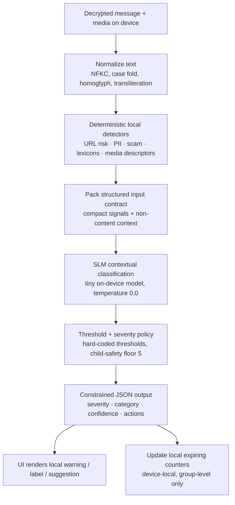

# KChat SLM Guardrail Skills — Architecture

## System Overview

KChat is an end-to-end encrypted messaging app. Plaintext exists only on the
sender and recipient devices. We add a **local safety assistant** to each
device — a tiny Small Language Model running a layered set of skill packs —
that classifies content already visible to the user and produces local
warnings, labels, and suggestions.

The SLM is **not** a centralized moderator. It is a personal safety co-pilot
governed by transparent, signed, versioned skill packs. The composition of
those skill packs into a runtime bundle is the heart of this architecture.

```
                     ┌──────────────────────────┐
                     │    GLOBAL BASELINE       │   always on
                     │   (taxonomy, severity,   │
                     │    privacy, schema)      │
                     └───────────┬──────────────┘
                                 │
              ┌──────────────────┴──────────────────┐
              ▼                                     ▼
   ┌────────────────────┐              ┌────────────────────────┐
   │ JURISDICTION       │  optional    │ COMMUNITY OVERLAY      │  optional
   │ OVERLAY            │              │ (school / family /     │
   │ (country / region) │              │  workplace / …)        │
   └─────────┬──────────┘              └────────────┬───────────┘
             └──────────────────┬───────────────────┘
                                ▼
                  ┌──────────────────────────┐
                  │   active_skill_bundle    │
                  │  + runtime context       │
                  └─────────────┬────────────┘
                                ▼
                       compiled SLM prompt
```

The **active skill bundle** at runtime is:

```
active_skill_bundle =
    global_baseline
  + jurisdiction overlays
  + community overlay
  + runtime context
```

Where `runtime context` is *non-content* metadata such as the group's
declared age mode, the recipient's relationship to the sender (already known
on-device), and timestamps. It is never derived from inferred attributes
(e.g. ethnicity, religion, GPS).

## Skill Layering Model

### 1. Global Baseline Skill — `kchat.global.guardrail.baseline`

The global baseline is **always active**. It defines:

- The 16-category global risk taxonomy (see [Global Risk Taxonomy](#global-risk-taxonomy)).
- The 0–5 severity rubric (see [Severity Rubric](#severity-rubric)).
- The non-negotiable privacy rules (see [Privacy Architecture](#privacy-architecture)).
- The structured input contract and the constrained JSON output schema.
- Decision policy thresholds and uncertainty handling.

No overlay may remove a category, change its ID, weaken severity for child
safety, or alter the privacy rules.

### 2. Jurisdiction Overlay Skill

Country / region-specific. May:

- Adjust legal-age definitions.
- Mark certain categories as illegal (raises floor severity).
- Add restricted symbols, listed extremist orgs, election rules.
- Add protected-class definitions.
- Restrict marketplace items (drugs, weapons, regulated goods).

A jurisdiction overlay is activated **only** by:

- The user's explicitly selected region.
- The group's declared jurisdiction.
- The app store / billing region for the install.
- An enterprise / managed-device policy.

A jurisdiction overlay is **never** activated by:

- GPS or other location inference.
- Inferred nationality, ethnicity, language, or religion.
- IP-geolocation.
- Network operator metadata.

### 3. Community Overlay Skill

Group-specific. Set by the group admin and visible to every member as part
of the group's transparency surface ("This group is using the
*school* skill pack v3.2 signed by KChat Trust & Safety on 2026-01-14"). May:

- Declare an age mode (`adult_only`, `mixed_age`, `minor_present`).
- Tighten or loosen specific categories (within global / jurisdiction
  bounds).
- Add community-specific labels (`#offtopic`, `#nsfw-allowed`,
  `#class-rules`).
- Configure local expiring counters (see [Community Labeling](#community-labeling)).

### Active Skill Bundle Formula

```
active_skill_bundle =
    global_baseline
  + jurisdiction overlays   # 0..N
  + community overlay       # 0..1
  + runtime context
```

Conflicts are resolved by `skill_selection.conflict_resolution` (see
[Skill Selection Logic](#skill-selection-logic)).

## Privacy Architecture

The full privacy contract from the global baseline:

```yaml
privacy_first:
  plaintext_handling:
    - Plaintext message bytes never leave the on-device SLM context.
    - The SLM input is constructed by the local guardrail runtime, not by
      a server.
    - The SLM has no network access during evaluation.
  allowed_outputs:
    - severity (integer 0..5)
    - category id (integer 0..15)
    - confidence (float 0..1)
    - boolean action flags (label_only / warn / strong_warn /
      critical_intervention / suggest_redact)
    - structured non-quoting reason codes from a closed enum
    - a short user-facing rationale generated from a closed phrasebook (no
      free-text echo of the input)
    - localized resource link IDs (e.g. crisis hotline ID, electoral
      authority ID) — never the resolved URL with parameters
    - update to local expiring counters (no content)
  forbidden_outputs:
    - the original message text
    - any verbatim span longer than 8 tokens from the input
    - hashes / fingerprints / embeddings / cryptographic commitments to
      input
    - sender / recipient / group identifiers
    - free-form natural-language rationale that re-states the message
    - any output that is only useful to a server-side moderator
    - any output that depends on contacting a remote service
```

The SLM is sandboxed: it has no network, no filesystem, no access to other
conversations or other users' devices. It receives the structured input
contract for a single message-in-context and emits a single JSON object
matching the output schema.

## Global Risk Taxonomy

| ID  | Category               | Description                                                                                       | Typical Local Action                                  |
| --- | ---------------------- | ------------------------------------------------------------------------------------------------- | ----------------------------------------------------- |
| 0   | SAFE                   | No detected risk.                                                                                 | None.                                                 |
| 1   | CHILD_SAFETY           | Content sexualising or endangering minors; grooming patterns; CSAM indicators.                    | Block preview, hard warn, surface report flow.        |
| 2   | SELF_HARM              | Suicide ideation, self-injury planning, pro-ana / pro-mia content.                                | Soft warn, surface local crisis resources.            |
| 3   | VIOLENCE_THREAT        | Credible threats of physical violence against an identifiable target.                             | Strong warn, surface report and block flows.          |
| 4   | EXTREMISM              | Recruitment / glorification of violent extremist orgs (jurisdiction-listed).                      | Strong warn; jurisdictional override possible.        |
| 5   | HARASSMENT             | Targeted insults, doxxing, sustained pile-on, sexual harassment.                                  | Warn, suggest mute / report.                          |
| 6   | HATE                   | Dehumanising speech against a protected class.                                                    | Warn; protected-speech context check.                 |
| 7   | SCAM_FRAUD             | Phishing, advance-fee fraud, fake giveaways, impersonation.                                       | Warn, mark links, surface report.                     |
| 8   | MALWARE_LINK           | Links / attachments matching malware or credential-stealing patterns.                             | Block link preview, hard warn.                        |
| 9   | PRIVATE_DATA           | PII / financial / credentials / location of self or others.                                       | Warn before send / before display, suggest redaction. |
| 10  | SEXUAL_ADULT           | Adult sexual content between consenting adults.                                                   | Label; gated by group age mode + jurisdiction.        |
| 11  | DRUGS_WEAPONS          | Sale or facilitation of drugs / firearms / regulated goods.                                       | Warn; jurisdictional override common.                 |
| 12  | ILLEGAL_GOODS          | Stolen goods, counterfeit currency, trafficked items.                                             | Warn; surface report flow.                            |
| 13  | MISINFORMATION_HEALTH  | Health claims contradicting public-health consensus in a high-harm context.                       | Label, link to authoritative source.                  |
| 14  | MISINFORMATION_CIVIC   | Election / civic misinformation in a jurisdiction-flagged window.                                 | Label, link to electoral authority.                   |
| 15  | COMMUNITY_RULE         | Content violating an explicit community-overlay rule.                                             | Label per community overlay action.                   |

Overlays may **narrow** a category (e.g. `SEXUAL_ADULT` is fully disallowed
in `community.school`) or **raise** its severity. They may not invent new
categories; they may not remove or rename categories.

## Severity Rubric

| Level | Name        | Meaning                                                                | Action                                              |
| ----- | ----------- | ---------------------------------------------------------------------- | --------------------------------------------------- |
| 0     | None        | No risk detected.                                                      | None.                                               |
| 1     | Informational | Minor signal, useful as label only.                                  | Soft label; no interruption.                        |
| 2     | Caution     | Possible issue; user benefit from awareness.                           | Inline label; expandable explanation.               |
| 3     | Warn        | Likely policy / safety risk.                                           | Modal warning before display or send.               |
| 4     | Strong warn | High-confidence harm to user or third party.                           | Hard modal; require explicit acknowledge to view.   |
| 5     | Critical    | Imminent harm, child safety, or jurisdictional illegality.             | Block preview; surface report / crisis resources.   |

Child-safety categories carry a **severity floor of 5** regardless of model
confidence (see [Child Safety Policy](#child-safety-policy)).

## SLM Execution Contract

Every SLM call receives a single structured input matching this schema:

```yaml
input_contract:
  message:
    text: string                  # already on-device plaintext, may be empty
    lang_hint: string?            # IETF BCP 47 (e.g. "en", "es-419"), optional
    has_attachment: bool
    attachment_kinds: [string]    # closed enum: image | video | audio | file | link
    quoted_from_user: bool        # this message is quoting earlier on-device content
    is_outbound: bool             # true if user is about to send
  context:
    group_kind: string            # closed enum: dm | small_group | large_group |
                                  #   public_channel
    group_age_mode: string        # closed enum: minor_present | mixed_age | adult_only
    user_role: string             # closed enum: member | admin | guest | self
    relationship_known: bool      # whether the user has affirmed relationship to peer
    locale: string                # IETF BCP 47
    jurisdiction_id: string?      # only if explicitly activated (see overlay rules)
    community_overlay_id: string? # if any
    is_offline: bool              # SLM must produce identical output when true
  local_signals:
    url_risk: float               # 0..1, from deterministic local detector
    pii_patterns_hit: [string]    # closed enum from PII detector
    scam_patterns_hit: [string]   # closed enum from scam detector
    lexicon_hits:                 # produced by jurisdiction lexicons
      - lexicon_id: string
        category: int             # taxonomy id
        weight: float             # 0..1
    media_descriptors:            # opaque local descriptors only
      - kind: string               # image | video | audio
        nsfw_score: float?         # 0..1, may be absent
        violence_score: float?     # 0..1, may be absent
        face_count: int?           # may be absent
  constraints:
    max_output_tokens: 600
    temperature: 0.0
    output_format: json
    schema_id: kchat.guardrail.output.v1
```

The SLM **reasons over local descriptors** — `lexicon_hits`,
`media_descriptors`, `pii_patterns_hit` — not over raw media bytes.
Decoding, OCR, ASR, and image classification all happen in deterministic
local detectors before the SLM is invoked.

## Hybrid Local Pipeline

The pipeline is hybrid by design: deterministic detectors handle anything
that does not need a model, and the SLM is reserved for *contextual*
decisions (news vs. praise of violence; quoted speech vs. authored speech;
educational vs. operational; counterspeech vs. hate).

1. **Normalize text** — Unicode NFKC, case folding, homoglyph map,
   transliteration to the lexicon language for matching only (the SLM
   receives the original text).
2. **Run deterministic local detectors** — URL risk, private-data patterns
   (PII, credentials, financial), scam patterns, jurisdiction lexicons,
   group age mode, attachment / media descriptors.
3. **Pass compact signals to SLM** — pack the structured input contract;
   the SLM never sees the raw lexicon, only the *hits*.
4. **SLM contextual classification** — distinguishes harm from news,
   satire, education, counterspeech, quoted speech.
5. **Apply severity and threshold policy** — hard-coded thresholds prevent
   prompt drift; child-safety floor enforced here.
6. **Produce local JSON** — UI consumes `actions`; **no plaintext leaves
   the device**.
7. **Update local expiring counters** — device-local, group-level safety
   hints (see [Community Labeling](#community-labeling)).



Steps (1)–(7) are entirely on-device; no step requires network access.

## Output Schema

```yaml
output_schema:
  type: object
  required: [severity, category, confidence, actions, reason_codes, rationale_id]
  properties:
    severity:    { type: integer, minimum: 0, maximum: 5 }
    category:    { type: integer, minimum: 0, maximum: 15 }
    confidence:  { type: number,  minimum: 0.0, maximum: 1.0 }
    actions:
      type: object
      required: [label_only, warn, strong_warn, critical_intervention, suggest_redact]
      properties:
        label_only:            { type: boolean }
        warn:                  { type: boolean }
        strong_warn:           { type: boolean }
        critical_intervention: { type: boolean }
        suggest_redact:        { type: boolean }
    reason_codes:
      type: array
      items:
        type: string
        enum:
          - LEXICON_HIT
          - SCAM_PATTERN
          - PRIVATE_DATA_PATTERN
          - URL_RISK
          - QUOTED_SPEECH_CONTEXT
          - NEWS_CONTEXT
          - EDUCATION_CONTEXT
          - COUNTERSPEECH_CONTEXT
          - GROUP_AGE_MODE
          - JURISDICTION_OVERRIDE
          - COMMUNITY_RULE
          - CHILD_SAFETY_FLOOR
    rationale_id: { type: string }   # closed phrasebook id, no free text
    resource_link_id: { type: string, nullable: true }
    counter_updates:
      type: array
      items:
        type: object
        properties:
          counter_id: { type: string }
          delta:      { type: integer }
```

Example output for a phishing-style message in a workplace community:

```json
{
  "severity": 3,
  "category": 7,
  "confidence": 0.81,
  "actions": {
    "label_only": false,
    "warn": true,
    "strong_warn": false,
    "critical_intervention": false,
    "suggest_redact": false
  },
  "reason_codes": ["URL_RISK", "SCAM_PATTERN"],
  "rationale_id": "scam_credential_phish_v1",
  "resource_link_id": "kchat_help_phishing_v1",
  "counter_updates": [
    { "counter_id": "group_scam_links_24h", "delta": 1 }
  ]
}
```

## Decision Policy

Confidence thresholds are **hard-coded** in the runtime — the SLM cannot
override them. They prevent prompt drift in tiny models.

| Threshold              | Confidence  | Effect                                                                |
| ---------------------- | ----------- | --------------------------------------------------------------------- |
| `label_only`           | ≥ 0.45      | Show a soft label; no interruption.                                   |
| `warn`                 | ≥ 0.62      | Modal warn before display or send.                                    |
| `strong_warn`          | ≥ 0.78      | Hard modal; require explicit acknowledge to view.                     |
| `critical_intervention`| ≥ 0.85      | Block preview; surface report / crisis flow.                          |

**Uncertainty handling.** If the SLM's confidence falls below the lowest
threshold (0.45) for any non-zero category, the runtime treats the message
as `SAFE` (category 0, severity 0) and emits no label. This avoids
"helpful-looking but wrong" labels. Tied categories at the same severity
break in favour of the lower-numbered category (the canonical taxonomy
order).

Child safety overrides the threshold table: any positive `CHILD_SAFETY`
signal at confidence ≥ 0.45 produces severity 5 and `critical_intervention`.

## Skill Selection Logic

```yaml
skill_selection:
  preferred_inputs:
    - user_selected_region              # explicit, in-app setting
    - group_declared_jurisdiction       # set by group admin
    - app_store_install_region          # billing / store region
    - enterprise_managed_policy         # MDM / managed device
    - explicit_community_overlay_id     # set by group admin
  avoid_inputs:
    - gps_location
    - ip_geolocation
    - inferred_nationality
    - inferred_ethnicity
    - inferred_religion
    - network_operator_metadata
  conflict_resolution:
    severity:
      rule: take_max
      note: |
        When global, jurisdiction, and community overlays disagree on
        severity for the same category, the highest severity wins.
    category:
      rule: most_specific_overlay
      note: |
        Community overlay > jurisdiction overlay > global baseline.
    action:
      rule: most_protective
      note: |
        Across overlays, the most protective action for the user wins
        (e.g. strong_warn > warn > label_only).
    privacy_rules:
      rule: immutable
      note: |
        Privacy rules from the global baseline are immutable. No overlay
        may relax them; the compiler rejects packs that try.
    child_safety:
      rule: floor_5
      note: |
        Any positive CHILD_SAFETY signal pins severity to 5 regardless of
        overlay configuration.
```

## Jurisdiction Overlay Template

```yaml
skill_id: kchat.jurisdiction.<region-code>.guardrail.v1
parent: kchat.global.guardrail.baseline
schema_version: 1
expires_on: <ISO-8601 date, max 18 months from sign>
signers: [trust_and_safety, legal_review, cultural_review]

activation:
  criteria:
    - user_selected_region: <region-code>
    - group_declared_jurisdiction: <region-code>
    - app_store_install_region: <region-code>
    - enterprise_managed_policy: <region-code>
  forbidden_criteria:
    - gps_location
    - ip_geolocation
    - inferred_nationality
    - inferred_ethnicity
    - inferred_religion

local_definitions:
  legal_age_general: <int>
  legal_age_sexual_content_consumer: <int>
  legal_age_marketplace_alcohol: <int>
  legal_age_marketplace_tobacco: <int>
  protected_classes: [<list of protected-class ids>]
  listed_extremist_orgs: [<list of org ids with provenance>]
  restricted_symbols: [<list of symbol ids with context rules>]
  election_rules:
    civic_window_open:  <ISO date>
    civic_window_close: <ISO date>
    authority_resource_id: <id from resource catalogue>

local_language_assets:
  primary_languages: [<BCP 47 codes>]
  lexicons:
    - lexicon_id: <id>
      language: <BCP 47>
      categories: [<taxonomy ids>]
      provenance: <reviewer / source>
  normalization:
    nfkc: true
    case_fold: true
    homoglyph_map_id: <id>
    transliteration_refs: [<id>]

overrides:
  - category: 4   # EXTREMISM
    severity_floor: 4
    note: <human-readable summary>
  - category: 10  # SEXUAL_ADULT
    severity_floor: 5
    note: <jurisdictional ban summary>
  - category: 11  # DRUGS_WEAPONS
    severity_floor: 4
    note: <regulated-goods summary>

allowed_contexts:
  - QUOTED_SPEECH_CONTEXT
  - NEWS_CONTEXT
  - EDUCATION_CONTEXT
  - COUNTERSPEECH_CONTEXT

user_notice:
  visible_pack_summary: <short, plain-language description>
  appeal_resource_id: <id from resource catalogue>
  opt_out_allowed: <bool>   # only true where lawful
```

## Community Overlay Template

```yaml
skill_id: kchat.community.<community-kind>.guardrail.v1
parent: kchat.global.guardrail.baseline
schema_version: 1
signers: [trust_and_safety]

community_profile:
  kind: <school | family | workplace | adult_only | marketplace |
         health_support | political | gaming | other>
  age_mode: <minor_present | mixed_age | adult_only>
  visibility: <public_summary | members_only_summary>
  set_by: group_admin

rules:
  - category: 10   # SEXUAL_ADULT
    action: <label_only | warn | strong_warn | block>
    note: <plain-language summary>
  - category: 13   # MISINFORMATION_HEALTH
    action: warn
    note: <peer-support context note for health_support>
  - category: 5    # HARASSMENT
    action: warn
    suggest_mute: true
  - category: 15   # COMMUNITY_RULE
    rule_set:
      - id: <community rule id>
        label: <short label>
        action: <label_only | warn | strong_warn>

group_risk_counters:
  - counter_id: group_scam_links_24h
    method: device_local_expiring_counter
    window: 24h
    thresholds:
      label_at:        3
      strong_label_at: 6
      escalate_at:     10
  - counter_id: group_violence_threats_7d
    method: device_local_expiring_counter
    window: 7d
    thresholds:
      label_at:        1
      escalate_at:     3
```

## Community Labeling

Community overlays may produce **device-local, group-level expiring
counters** for risk hints. They **do not** upload counters to a server.
They only inform local UI labels (e.g. "this group has had multiple
flagged links in the last 24 hours") visible to the user on this device
for this group.

```yaml
community_labeling:
  method: device_local_expiring_counter
  window: 24h
  thresholds:
    label_at:        3
    strong_label_at: 6
    escalate_at:     10
  labels:
    label_at:        "elevated risk in this group (recent flags)"
    strong_label_at: "high recent risk in this group"
    escalate_at:     "this group is showing patterns matching scam / abuse rings"
  storage:
    location: device_local
    encryption: device_keystore
    upload: forbidden
```

## Child Safety Policy

```yaml
child_safety_policy:
  priority: highest
  severity_floor: 5
  applies_when:
    - group_age_mode == "minor_present"
    - any participant is flagged as minor by managed-device policy
    - jurisdiction overlay declares a minor-protection rule that matches
  detectors:
    - csam_indicators              # opaque local descriptor only
    - grooming_patterns            # lexicon + SLM contextual
    - sextortion_patterns          # lexicon + SLM contextual
    - request_for_private_meeting_with_minor
  actions:
    - critical_intervention: true
    - block_preview: true
    - surface_report_flow: true
    - surface_local_resources: true
  forbidden:
    - upload of detected content, descriptors, hashes, or evidence to any
      server by default
    - any flow that depends on remote service availability
  user_notice:
    rationale_id: child_safety_floor_v1
    resource_link_id: child_safety_resources_v1
```

The runtime's child-safety reporting flow is **user-initiated**: the device
surfaces local resources and the option to report; it does not auto-upload.

## Runtime SLM Instruction Prompt

The compiled prompt always begins with this 10-rule instruction. It is
deliberately short so it fits comfortably in a tiny SLM's instruction
budget.

```
You are KChat's on-device safety assistant. Follow these rules exactly.

1. Use only the structured input. Never invent context, never infer
   identity, location, ethnicity, religion, or social graph.
2. Output only the JSON schema kchat.guardrail.output.v1. No prose.
3. Choose exactly one category from the global taxonomy (0..15).
4. Severity is integer 0..5 per the rubric. CHILD_SAFETY (1) has a
   severity floor of 5.
5. Confidence is in [0.0, 1.0]. Below 0.45, output SAFE (category 0,
   severity 0).
6. Reason codes come from the closed enum. Never write free-text reasons.
7. Never echo more than 8 contiguous tokens of the input in any field.
8. Never output identifiers (sender, recipient, group, message id).
9. Distinguish authored harm from quoted speech, news, education,
   counterspeech, and satire. Mark the relevant context reason code.
10. Apply jurisdiction and community overrides exactly as compiled into
    this prompt. Never relax a privacy rule or invent a new category.
```

## Compiled Prompt Example

A minimal compiled prompt for a workplace community in a jurisdiction with
strict marketplace rules:

```
[INSTRUCTION]
<10-rule runtime instruction>

[GLOBAL_BASELINE]
taxonomy: 16-category v1
severity: 0..5 v1
privacy_rules: v1 (immutable)
output_schema: kchat.guardrail.output.v1
thresholds: label_only=0.45 warn=0.62 strong_warn=0.78 critical=0.85

[JURISDICTION_OVERLAY]
id: kchat.jurisdiction.archetype-strict-marketplace.v1
overrides:
  - category 11 DRUGS_WEAPONS severity_floor 4
  - category 12 ILLEGAL_GOODS severity_floor 4
allowed_contexts: QUOTED_SPEECH_CONTEXT, NEWS_CONTEXT, EDUCATION_CONTEXT,
                  COUNTERSPEECH_CONTEXT

[COMMUNITY_OVERLAY]
id: kchat.community.workplace.guardrail.v1
age_mode: adult_only
rules:
  - category 5 HARASSMENT action=warn suggest_mute=true
  - category 9 PRIVATE_DATA action=warn suggest_redact=true
  - category 10 SEXUAL_ADULT action=strong_warn
counters:
  - group_scam_links_24h thresholds 3/6/10

[INPUT]
<structured input contract instance>

[OUTPUT]
<JSON conforming to kchat.guardrail.output.v1>
```

Total compiled instruction budget: **< 1800 tokens**. Output budget:
**< 600 tokens**. Temperature: **0.0**.

## Skill Pack Compiler Pipeline


Each compiled and signed pack carries a **skill passport**:

```yaml
skill_passport:
  skill_id: <kchat.…>
  skill_version: <semver>
  schema_version: 1
  parent: kchat.global.guardrail.baseline
  authored_by: <author handle>
  reviewed_by:
    legal:    [<reviewer handles>]   # required for jurisdiction packs
    cultural: [<reviewer handles>]   # required for jurisdiction packs
    trust_and_safety: [<reviewer handles>]
  model_compatibility:
    - model_id: <slm model id>
      model_min_version: <semver>
      max_instruction_tokens: 1800
      max_output_tokens: 600
  expires_on: <ISO-8601 date, max 18 months>
  test_results:
    child_safety_recall:               <float>
    child_safety_precision:            <float>
    privacy_leak_precision:            <float>
    scam_recall:                       <float>
    protected_speech_false_positive:   <float>
    minority_language_false_positive:  <float>
    p95_latency_ms:                    <int>
  signature:
    algorithm: ed25519
    key_id: <key id>
    value: <base64 signature>
```

## Anti-Misuse Controls

```yaml
anti_misuse_controls:
  transparency:
    - active skill packs visible to user (ids, versions, signers)
    - per-decision rationale_id is mappable to a public phrasebook entry
    - public changelog of skill packs and their reviewers
  narrowness:
    - no vague categories permitted
    - jurisdiction overlays may not invent categories
    - lexicons must declare provenance and reviewer
  protected_contexts:
    - quoted speech
    - news
    - education
    - counterspeech
    - satire (where the satire context is explicit)
  review:
    - jurisdiction packs require legal + cultural review before signing
    - community packs require trust_and_safety review before signing
    - bias audits for protected-class and minority-language effects
      are required for every signed pack
  user_rights:
    - visibility of active packs
    - appeal flow surfaced from any warn / strong_warn / critical action
    - opt-out of optional overlays where lawful
    - no silent activation of jurisdiction overlays
  technical:
    - signed packs (ed25519)
    - rollback: previous N signed packs retained on device
    - expiry: packs without a future expires_on are inactive
    - pack passport mismatch with model = inactive
    - no skill output may demand network access
```

## User-Facing Actions

| Action                  | UX surface                                                                 |
| ----------------------- | -------------------------------------------------------------------------- |
| Soft label              | Inline pill near the message (e.g. "scam-like link").                      |
| Warn modal              | Modal before displaying the message; "view anyway" + "report" + "mute".    |
| Strong warn modal       | Hard modal; explicit acknowledgement required; "report" prominent.         |
| Critical intervention   | Block preview; surface report flow + local resources (e.g. crisis hotline).|
| Suggest redact (compose)| Inline suggestion before send; "redact and continue".                      |
| Group risk label        | Group header label from local expiring counters.                           |
| Crisis resource         | Local resource link (no remote tracking) for self-harm / child safety.     |
| Civic / health resource | Local resource link to electoral / health authority for misinformation.    |
| Appeal                  | "Why this label?" surface with rationale_id and appeal flow.               |

## Recommended Folder Structure

```
/kchat-skills
├── global/
│   ├── baseline.yaml                # kchat.global.guardrail.baseline
│   ├── taxonomy.yaml                # 16-category global taxonomy
│   ├── severity.yaml                # 0–5 severity rubric
│   ├── output_schema.json           # constrained JSON output
│   ├── local_signal_schema.json     # SLM input contract
│   └── privacy_contract.yaml        # non-negotiable privacy rules
│
├── jurisdictions/
│   ├── _template/
│   │   └── overlay.yaml             # jurisdiction overlay template
│   ├── archetype-strict-adult/
│   │   ├── overlay.yaml             # severity_floor 5 on category 10
│   │   ├── normalization.yaml
│   │   └── lexicons/
│   ├── archetype-strict-hate/
│   │   ├── overlay.yaml             # severity_floor 5 on cat 4, 4 on cat 6
│   │   ├── normalization.yaml
│   │   └── lexicons/
│   ├── archetype-strict-marketplace/
│   │   ├── overlay.yaml             # severity_floor 4 on cat 11 & 12
│   │   ├── normalization.yaml
│   │   └── lexicons/
│   └── <country-code>/              # filled per-country packs
│       ├── overlay.yaml
│       ├── lexicons/
│       ├── normalization.yaml
│       └── tests/
│
├── communities/
│   ├── _template/
│   │   └── overlay.yaml             # community overlay template
│   ├── school.yaml
│   ├── family.yaml
│   ├── workplace.yaml
│   ├── adult_only.yaml
│   ├── marketplace.yaml
│   ├── health_support.yaml
│   ├── political.yaml
│   └── gaming.yaml
│
├── prompts/
│   ├── runtime_instruction.txt      # 10-rule SLM instruction
│   ├── compiled_prompt_format.md    # compiled-prompt section reference
│   └── compiled_examples/
│
├── compiler/
│   ├── pipeline.md
│   ├── skill_passport.schema.json
│   ├── counters.py                  # device-local expiring counter store
│   ├── pipeline.py                  # 7-step hybrid local pipeline (Phase 3)
│   ├── slm_adapter.py               # SLMAdapter Protocol + MockSLMAdapter (Phase 3)
│   └── threshold_policy.py          # hard-coded threshold enforcement (Phase 3)
│
├── tests/
│   ├── test_suite_template.yaml     # Phase 1 metrics framework
│   ├── test_test_suite_template.py
│   ├── global/
│   ├── jurisdictions/
│   └── communities/
│
└── docs/
    ├── PROPOSAL.md
    ├── ARCHITECTURE.md
    └── PHASES.md
```

### Test Tooling

Validation tests live under `kchat-skills/tests/` and run with **pytest**
(Python ≥ 3.10). Static skill artifacts (`taxonomy.yaml`, `severity.yaml`,
`output_schema.json`, `baseline.yaml`, `local_signal_schema.json`,
`privacy_contract.yaml`, etc.) are loaded with **PyYAML** and validated
against their schemas with **jsonschema** (Draft-07).

Concrete test files in this repository:

- `kchat-skills/tests/global/test_taxonomy.py` — 16-category taxonomy.
- `kchat-skills/tests/global/test_severity.py` — 0–5 severity rubric and
  child-safety floor of 5.
- `kchat-skills/tests/global/test_output_schema.py` — Draft-07 SLM output
  schema (`kchat.guardrail.output.v1`).
- `kchat-skills/tests/global/test_baseline.py` — global baseline skill
  (Phase 1 complete).
- `kchat-skills/tests/global/test_local_signal_schema.py` — Draft-07 SLM
  input contract (`kchat.guardrail.local_signal.v1`).
- `kchat-skills/tests/global/test_privacy_contract.py` — eight
  non-negotiable privacy rules and the plaintext-handling /
  allowed-outputs / forbidden-outputs blocks.
- `kchat-skills/tests/global/test_prompts.py` — runtime SLM instruction
  prompt and compiled-prompt example.
- `kchat-skills/tests/global/test_counters.py` — device-local expiring
  counter store (`kchat-skills/compiler/counters.py`): increment /
  retrieval, per-window expiry, threshold-based label generation,
  per-group scoping, `counter_updates`-array consumption, encrypted
  at-rest persistence.
- `kchat-skills/tests/global/test_baseline_cases.py` — first round of
  baseline test cases (input / expected-output pairs) covering all 16
  taxonomy categories, the four protected-speech contexts, and the
  decision-policy threshold boundaries (0.44, 0.45, 0.62, 0.78, 0.85).
- `kchat-skills/tests/test_test_suite_template.py` — structural
  validation of the Phase 1 metrics framework at
  `kchat-skills/tests/test_suite_template.yaml`.
- `kchat-skills/tests/communities/test_community_overlays.py` —
  parametrised validation of the 8 community overlays.
- `kchat-skills/tests/jurisdictions/test_jurisdiction_template.py` —
  jurisdiction overlay template (required keys, forbidden-criteria
  enumeration, protected-speech allowed contexts).
- `kchat-skills/tests/jurisdictions/test_archetype_strict_adult.py` —
  `jurisdiction.archetype-strict-adult` overlay (severity_floor 5 on
  category 10, all required activation / signer / language-asset
  fields).
- `kchat-skills/tests/jurisdictions/test_archetype_strict_hate.py` —
  `jurisdiction.archetype-strict-hate` overlay (severity_floor 4-5 on
  categories 4 and 6, explicit protected-speech contexts).
- `kchat-skills/tests/jurisdictions/test_archetype_strict_marketplace.py`
  — `jurisdiction.archetype-strict-marketplace` overlay
  (severity_floor 4 on categories 11 and 12, all required activation /
  signer / language-asset fields, explicit protected-speech contexts).
- `kchat-skills/tests/jurisdictions/test_minority_language_fp.py` —
  per-archetype minority-language and code-switching false-positive
  corpus (structural contract validation, per-archetype and per-tag
  coverage floors, pinning of the
  `minority_language_false_positive <= 0.07` target).
- `kchat-skills/tests/global/test_pipeline.py` — 7-step hybrid local
  pipeline (`kchat-skills/compiler/pipeline.py`): normalization,
  deterministic detectors, signal packaging, end-to-end classification
  with a mock SLM adapter, threshold-policy coercion, counter-store
  integration.
- `kchat-skills/tests/global/test_slm_adapter.py` — backend-agnostic
  `SLMAdapter` Protocol and the deterministic `MockSLMAdapter`
  reference implementation at `kchat-skills/compiler/slm_adapter.py`.
- `kchat-skills/tests/global/test_threshold_policy.py` — hard-coded
  threshold enforcement at `kchat-skills/compiler/threshold_policy.py`:
  four confidence thresholds, uncertainty handling, lower-numbered-
  category tie-break, and the CHILD_SAFETY severity-5 floor.

See [`PROGRESS.md`](PROGRESS.md) and the project [`README.md`](README.md)
for the full test toolchain and run instructions.
